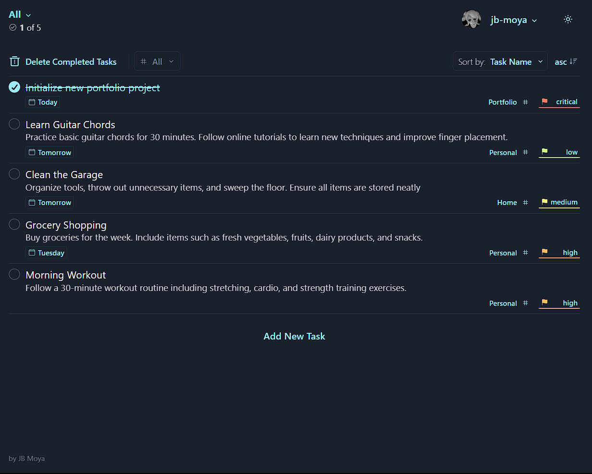

# Swish ToDo App


**ToDo App** is a dynamic, secure, and user-friendly task management application built with Firebase and styled with ChakraUI. This app empowers users to efficiently manage their tasks by offering a range of robust features while ensuring data privacy and security through Firebase's authentication services.



## Current Features

- **Authentication**: Seamless Google Sign-In for secure user authentication.
- **CRUD Operations**: Effortlessly create, read, update, and delete tasks.
- **Filters**: Apply date, schedule, priority, and category filters to organize tasks effectively.
- **Sorting**: Sort tasks by name, priority, and schedule for easy navigation.
- **Light/Dark Theme**

## Recommended Future Features

1. **Time Scheduling**: Enhance task management by allowing users to set specific times for their tasks.
2. **SubTasks**: Introduce the ability to add and manage subtasks for better task organization and hierarchy.

## ReadRave Project Setup Guide

This guide provides step-by-step instructions on how to fork and set up the ReadRave project with Firebase.

### Prerequisites

Before you begin, ensure you have the following installed on your machine:

- Node.js (LTS version)
- npm or yarn
- Firebase CLI
- Git

1. Fork the Repository

2. Clone the Forked Repository

3. Install Dependencies

    ```bash
    npm install // or yarn install
    ```

4. Set Up Firebase

    Install the Firebase CLI if you haven't already:

    ```bash
    npm install -g firebase-tools
    firebase login
    firebase init
    ```

5. Configure Environment Variables

6. Run the Development Server

    ```bash
    npm run dev // or yarn dev
    ```
